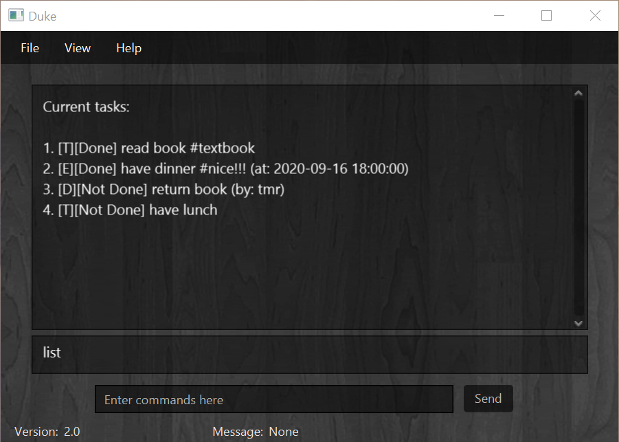

# User Guide

## Duke

**Duke** is an application that can help you to *manage tasks*. It supports *saving*, *editing*, *deleting* and 
*displaying* **tasks** using simple **commands**.

### Quick Start

**Prerequisites: Java 11 or later installed.**

1. **Download** the latest version of Duke `(a jar file)` from the [website](https://github.com/Ma-Yueran/ip/releases).
1. **Copy** the jar file to the directory you want to use as the *home directory* for the application.
1. `Double click` the jar file or enter `java -jar duke.jar` in console to run the program.
1. The window shown above should appear.
1. *Well done!* Now you can start using Duke!

## Features 

### Creates a new ToDo task

Command: `todo`

Format: `todo <task description>`

Example: `todo read book`

Expected outcome: *Todo* task created **if there is no duplications**.

### Creates a new Event task

Command: `event`

Format: `event <task description> /at <time>`

Example: `event have dinner /at 18:00`

Expected outcome: *Event* task created **if there is no duplications**.

### Creates a new Deadline task

Command: `deadline`

Format: `deadline <task description> /by <time>`

Example: `deadline return book /by next Firday`

Expected outcome: *Deadline* task created **if there is no duplications**.

### Lists current tasks

Command: `list`

Format: `list`

Example: `list`

Expected outcome: A list of current tasks shown.

### Deletes a task using an index

Command: `delete`

Format: `delete <task index>`

Example: `delete 1`

Expected outcome: The task with the given index is deleted.

### Tags a task

Command: `tag`

Format: `tag <task index> <tag>`

Example: `tag 2 This is a tag...`

Expected outcome: The task with the given index is tagged with the input tag string.

### Removes the tag of a task

Command: `untag`

Format: `untag <task index>`

Example: `untag 2`

Expected outcome: The tag of  the task with the given index is removed.

### Marks a task as done

Command: `done`

Format: `done <task index>`

Example: `done 3`

Expected outcome: The task with the given index is marked as done.

### Finds tasks using a keyword (does not have to be a word)

Command: `find`

Format: `find <keyword>`

Example: `find re`

Expected outcome: All tasks that contains the keyword in their description are shown.

### Shows all available commands

Command: `help`

Format: `help`

Example: `help`

Expected outcome: Descriptions and formats of all commands are shown.

### Exits the application

Command: `bye`

Format: `bye`

Example: `bye`

Expected outcome: All current tasks are saved, and the application ends.

### Shows the table of current tasks

Method: Click `View` -> `Task List...`

Expected outcome: A window containing the table of tasks pops up.

### Shows the table of all commands

Method: Click `Help` -> `Commands...`

Expected outcome: A window containing the table of all commands pops up.

## Saving Task Data

**3 Ways of Saving Task Data in Duke**

* Click `File` -> `Save`
* Choose `Yes` in Exit window.

* Enter command `bye` to exit the application.